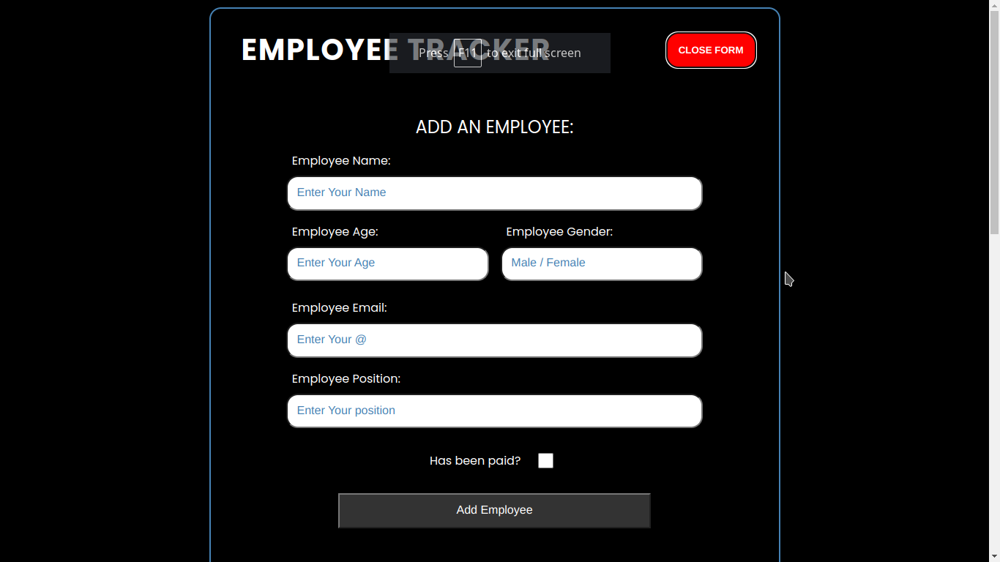

# Employee Trello

> Created by <a href="https://www.github.com/T-AT"> Syuq </a>

## 🚧 Description

This project was created using [Angular CLI](https://github.com/angular/angular-cli) version 15.2.6.

`Employee Trello` is a project developed using Node, Angular, Typescript, HTML5 and CSS. It is an application that allows a user to keep track of employees in a company and managing their payment tracking.

## 👀 Product Preview



## 🏗️ Development server

Run `ng serve` for the development server. Navigate to __`http://localhost:4200/`__. The application will automatically reload if you change any of the source files.

## 🏁 APPLICATION CONFIGURATION

Install dependencies

```` (nodejs)
npm install
````

Run Angular server __(http://localhost:4200)__

```(nodejs)
ng serve
```

Run the JSON server __(http://localhost:5000)__

```(nodejs)
npm run server
```

## ⏬ Setup/Installation Minimal Requirements

You will need to have the following installed on your system for the application to run:

* Modern Browser.
* 'Node.js' installed on your machine

## ➕ Compatibility

Compatible with all modern browsers.

## 🤖 Technologies Used

It is made entirely using Visual Studio Code in collaboration with the Angular CLI to create all the files and to achieve the output as you see it.

* `Typescript` - Angular core language.
* `Angular` - Client-Side Frontend Framework.
* `JSON Server` - Dummy backend JSON server that allows for all CRUD functions.

```(nodejs)
npm install npm-server
```

* `Font Awesome` - Provides icons

```(nodejs)
ng add @fortawesome/angular-fontawesome
```

## 🪲 Known Bugs

No bugs to report at the moment! the system works efficiently at 100% guaranteed.

> Cross platform support are under development using React

## 🏗️ Setup Instructions

In order to enjoy the features of this application you will need to:

* Git clone [this](https://github.com/T-AT/Employee-Trello) into your terminal to your
  desired directory.
* Open the project in an IDE of choice (Eg: Visual Studio Code).
* Run 'ng serve' to run the application on the development server.
* Open the package.json and add the following script in the `script` section:

```(json)
local-server: json-server --watch db.json
```

* Run the local server using: (Should run on __https://localhost:3000__)

```(nodejs)
npm run local-server
```

* Enjoy the `Employee Trello` Angular Application.

## 📧 Support and contact details

Contact me through any of the following:

* Email: tatd.wine@gmail.com
* Github: syuq

## 📃 License

Click the following to access the license
page: [Click-Here](https://githiomi.github.io/Privacy-Policy/)

> Copyright (c) {2023} Syuq Co.
